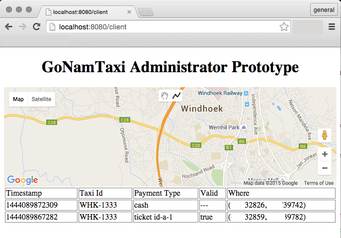
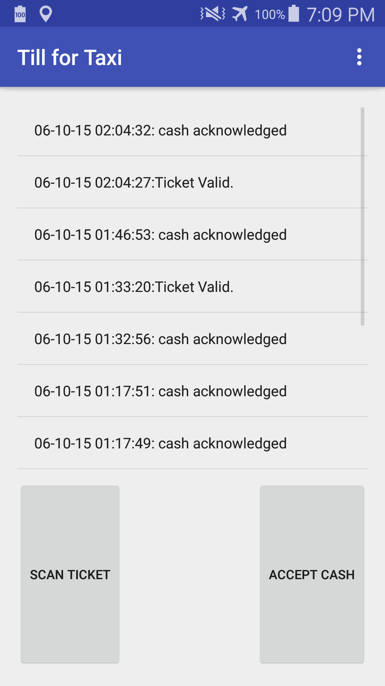
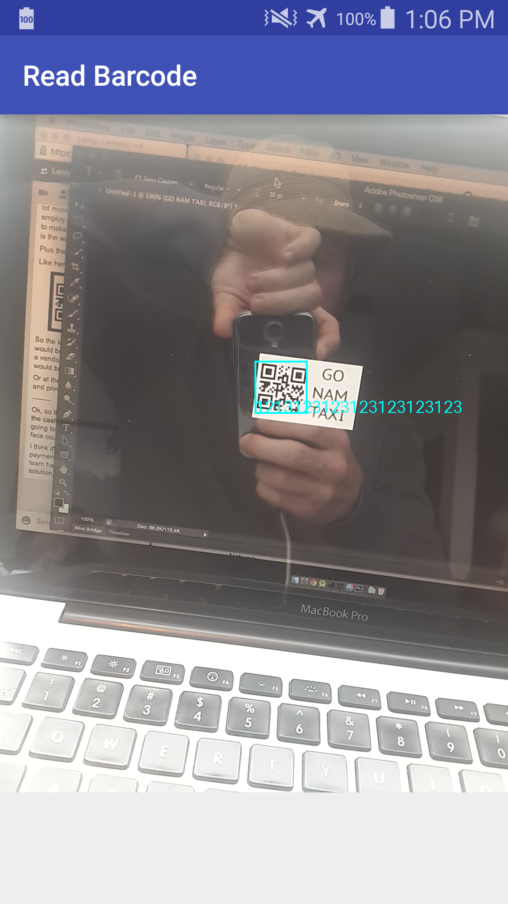

#GoNamTaxi Hackathon Prototype 2015
Developed under the team moniker of 'Logic++' and presented as 'eCab' to the judging panel.

#The Challenge
To develop a fast, friendly, fraud resistant, payment method for transportation in Namibia.

#The plan and final outcome
The initial designs employed a visual passenger tracking system coupled to a manual cash payment counter. The implementation involved computer vision and a machine learning algorithm. The system would be deployed as a camera-equipped Android device mounted inside the taxi, and coupled to our backend system through a mobile network. This approach had to be abandoned due to time constraints and pedantic issues. Thus the system underwent a rapid redesign into a platform for scanning QR codes as tickets.

The prototype submitted at the hackathon's conclusion consists of two components:

* The Server, providing a ticket transaction API and a web based administration interface.
* Till for Taxi, an Android app to scan QR Code tickets and log transactions with GPS coordinates.

##Avenues for further development

- The QR identification system is currently insecure. It needs a robust ID generator.
- A means for passengers to purchase tickets electronicially, via a browser or app.
- A means for passengers to verify that a ticket is valid before attempting to use it.

###Admin Interface
[](README.images/admin.png)

###TillApp
[](README.images/tillapp.png)
[](README.images/barcode.png)

#Server Prerequisites
  * [Node](http:https://nodejs.org/)
  * Google Maps API Keys, for both Server and Browser.
  
#Server Installation

Clone the repository and install NPM dependencies:
```
git clone https://github.com/abrie/go-nam-taxi.git
cd go-nam-taxi
npm install
```

The server will not work without a file describing the API keys. These should be stored in the ./private directory, but are not checked into the repository for security reasons. You'll need to generate your own keys. Follow the instructions provided by Google:

* https://developers.google.com/maps/documentation/javascript/get-api-key#key
* You'll need both a Browser Key and a Server Key.

#Running the Server

Install your Google API keys into a file named 'api keys.json' into the private/ directory:
```
{
  "google_maps_server_key":"paste-your-server-key-here",
  "google_maps_browser_key":"paste-your-browser-key-here"
}
```

You may then start the server:

```
node server.js
```
This will start a server on localhost, and if all is good you'll be greeted with the following:
```
#GoNamTaxi Prototype Server
````
The server is then listening on port 8080. You may then open a browser and connect to the server using the url: [http://localhost:8080/client](http://localhost:8080/client).
